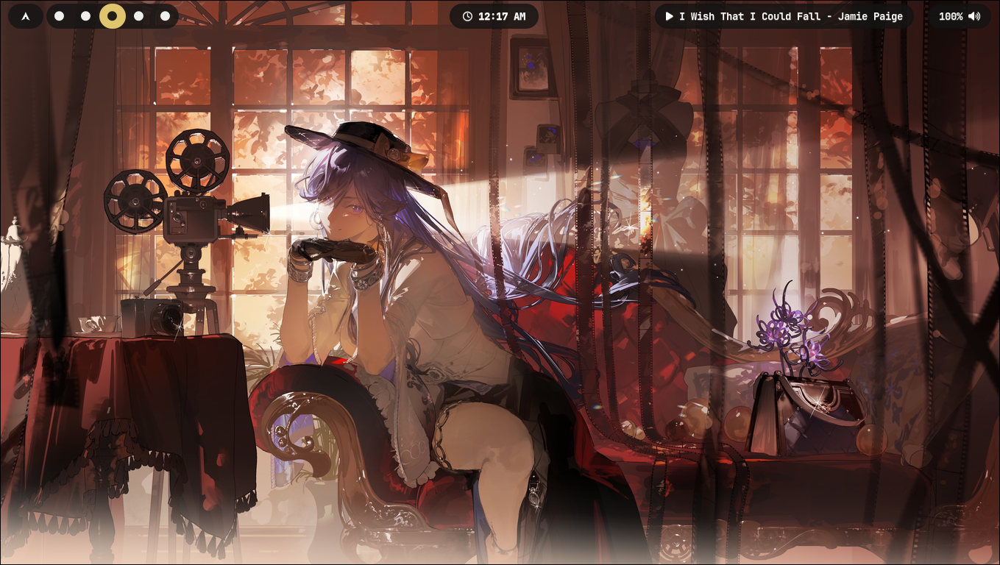
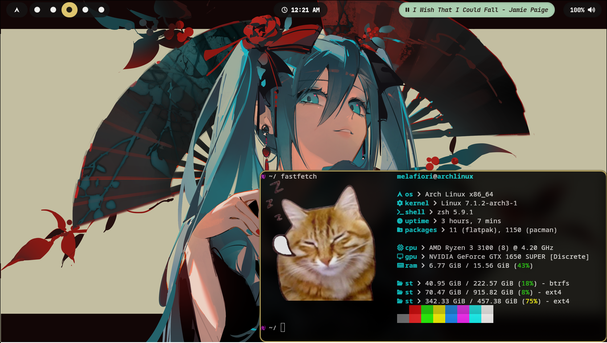
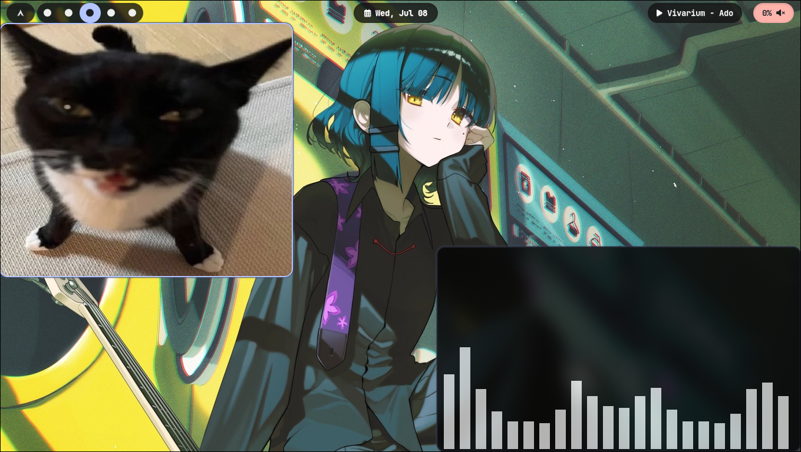
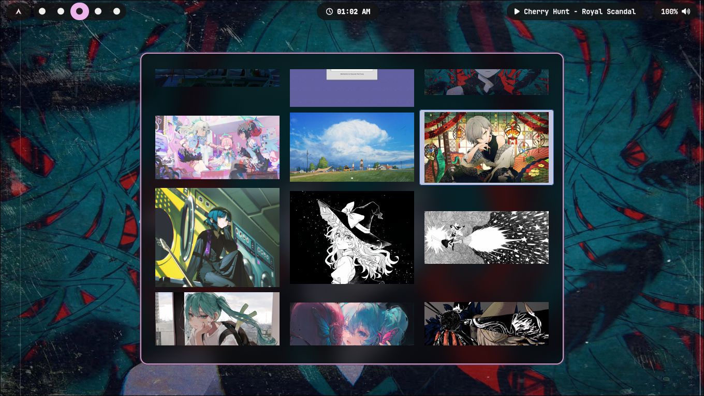

# My personal dotfiles

Just made them so i can keep them in case i delete everything or something.

### What I use:
* **WM:** Hyprland
* **Terminal:** Kitty
* **Theme:** Matugen
* **Shell:** zsh
* **Wallpaper:** awww/waypaper

## Preview
<p align="center">
  
  
  
  
</p>

If you only want the wallpapers, [here](wallpapers/).

# Prerequisites

Please make sure you have the following installed before using the install script:
- `hyprland`(obviously)
- `git`
- `matugen`
- `kitty`
- `waybar`
- `waypaper`

# Installation

```
git clone https://github.com/melafiori/public-dotfiles.git
cd public-dotfiles/
chmod +x ~/dotfiles/install.sh
install.sh
```
## ⚠️ Warning
This script will overwrite your existing configuration files in `~/.config/` by creating symlinks. **Please back up your current configs before running the script.**

# Troubleshooting
### Note:
This script uses `rm -rf` to replace existing files. Be careful with scripts you run from the internet!

### Known Issues
- If `matugen` colors don't apply immediately, ensure `hyprland.conf` and your CSS files are properly importing the generated files.
- Please remember to `chmod +x` the install script =(.
